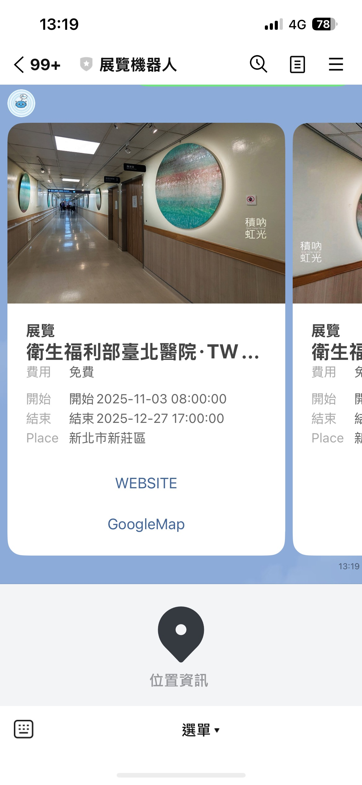
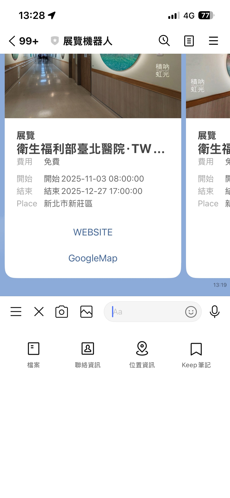
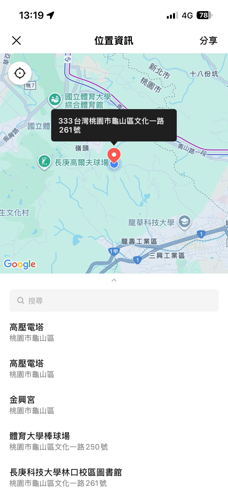

# 台北展覽資訊小幫手

周末在台北，不知道去哪裡?
這個展覽資訊的 LINE 機器人。它能協助您快速發現身邊的展覽活動，讓藝文生活觸手可及。透過介接台北文化快遞 Open Data，為您提供最即時的藝文資訊。

## ✨ 主要功能

### 📍 隨身導覽：尋找附近的展覽
不知道附近有什麼好逛的嗎？
只要在聊天室中傳送您的 **「位置資訊」**，機器人就會立即計算距離，並為您推薦距離最近的 3 個展覽活動。

### 2. 🎫 完整資訊卡片
不需要跳轉多個網頁！使用精美的圖文卡片 (Flex Message) 呈現：
- **展覽海報**：一目了然的視覺呈現。
- **活動時間**：清楚標示開始與結束日期。
- **票價資訊**：免費或售票資訊。
- **地圖導航**：內建 Google Maps 按鈕，點擊即可開啟導航。

## 🚀 如何開始使用

1. 加入此 LINE Bot 好友

2. 點擊聊天室左下角的 `+` 號，選擇 **「位置資訊」** 並傳送。

3. 或者直接在圖文選單點擊 **「查詢展覽」**。

---

## 資料來源

- 台北市文化快遞 Open Data
